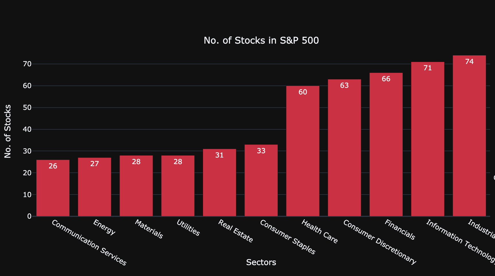
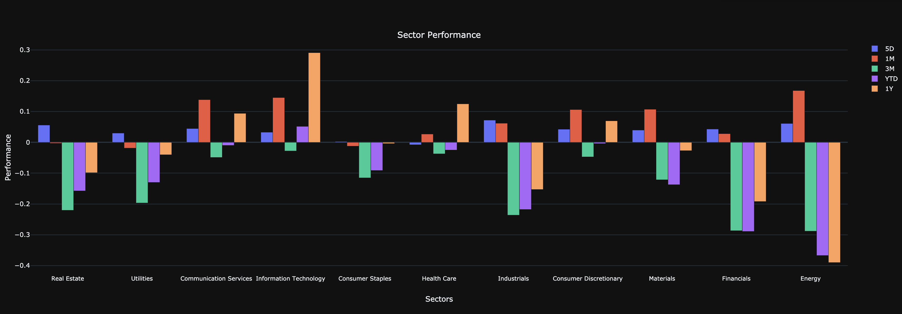
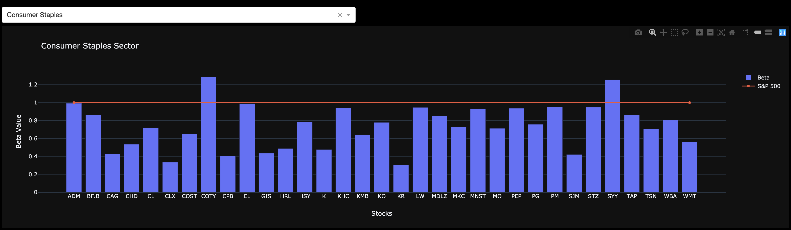
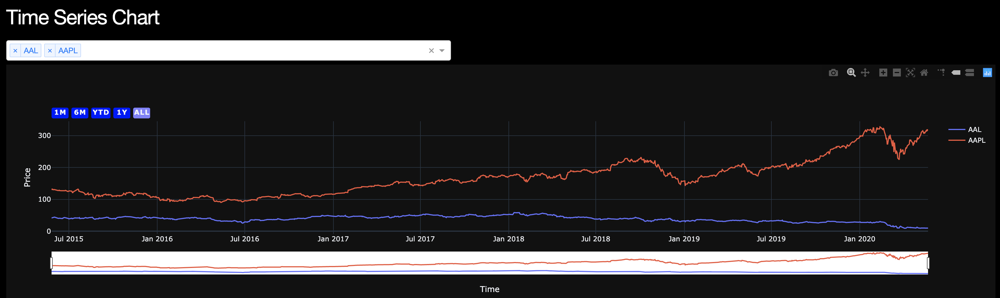

# S&P 500 Analysis

Link to application  - [S&P 500 Analysis](https://sp500-performance-analysis.herokuapp.com/)

## Applications :

   #### Sector Performance

   

   Stock market sectors are groups of stocks based on similar characteristics. This can include related products, services or shared operations. MSCI (Morgan Stanley Capital International) alongside S&P Dow Jones Indices built this classification system. There are 11 sectors, each divided further into industry groups, industries and sub-industries.

    1. Communication Services
    2. Consumer Discretionary
    3. Consumer Staples
    4. Energy
    5. Financials
    6. Healthcare
    7. Industrials
    8. Information Technology
    9. Materials
    10. Real Estate
    11. Utilities
    
   ##### Stocks under each Sector
   
   
   
    
  Below, We analyzed each sectors performance under S&P 500 over the period of one Year. We could easily see `Information Technology` is consistently performing well where as `Energy sector` is not performing well.
  
  

  
   #### Stock Performance

   Here We analyzed each stocks using Beta (5 Years monthly) value which helps to find the better performing stock in each sector. 
    
   > **Beta is a measure of a stock's volatility in relation to the overall market**
    
   By definition, the market, such as the S&P 500 Index, has a beta of 1.0, and individual stocks are ranked according to how much they deviate from the market. A stock that swings more than the market over time has a beta above 1.0. Below visualizaiton helps to identify the better performaning stock. 
    
   
   
   
   #### Time Series Chart

   A simple and effective technique for analyzing time series data is by visualizing it on a graph, from which we can infer certain assumptions. This section will guide you through the process of downloading a dataset of stock prices from `Yahoo` and plotting it on a price. Dropdown box which list all the tickers listed under S&P 500. By selecting the ticker, it will get the stock prices for 5 years of time period from Yahoo API and render as Time Series chart.

   

## Dash

[Dash](https://plotly.com/python/) is a productive Python framework for building web applications.

Written on top of Flask, Plotly.js, and React.js, Dash is ideal for building data visualization apps with highly custom user interfaces in pure Python. It's particularly suited for anyone who works with data in Python.

Here We created Dash Framework for building application and Plotly for data visualization.

## Heroku

[Heroku](https://www.heroku.com) is a platform as a service (PaaS) that enables developers to build, run, and operate applications entirely in the cloud. Application is delopyed in Heroku helps for each visualization

#### [S&P 500 Analysis](https://sp500-performance-analysis.herokuapp.com/)

## Package Used:

* Pandas Datareader
* Plotly
* Dash
